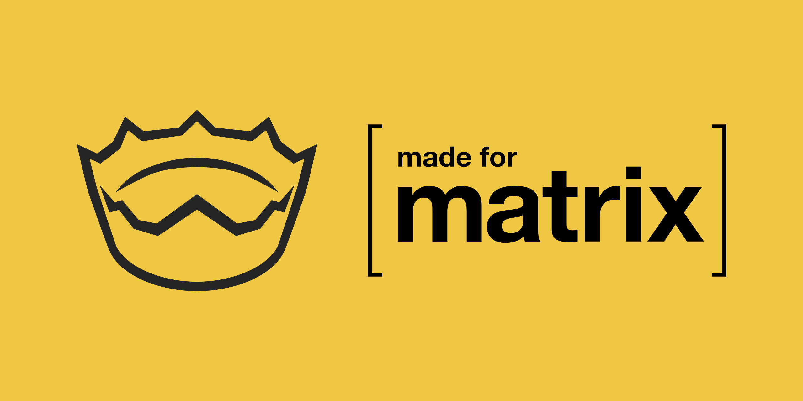

# Matrix Nim SDK (CS & AS)
A [Matrix](https://matrix.org/) library for the [client-server](https://matrix.org/docs/spec/client_server/r0.6.1.html) and [appservice](https://matrix.org/docs/spec/application_service/r0.1.2.html) API's written in [Nim](https://nim-lang.org)!

**status:** Not ready for production. The library is actively worked on and there will be a version one released when it's ready for general use.

## 100% Pure!
This is a pure Nim library, meaning it can be used where ever Nim can compile to, such as; NodeJS, front-end JavaScript, C, and C++.

## Multi Sync Support
The library produces both blocking and asynchronous code for native environments. As for JavaScript it is all asynchronous (promise based).

## Community
Need help or want to join our community? Join the Matrix room! [#matrix-nim-sdk:newcircuit.io](https://matrix.to/#/#matrix-nim-sdk:newcircuit.io) There are also announcements about how the project is doing in the discussions tab on GitHub.

---

# Matrix Audience
These are the types of developers on Matrix that this library targets.

## Bot Developers
This library aims to be easy to use out of the box. It will handle all of the specific details that go into interacting with a Matrix server. With that in mind it allows developers to quickly start a bot with a few lines of code, as well as being a learning guide into Nim and programming in general.

If you're transitioning from another language like Python or JavaScript there will be side-by-side guides for you to transition into the Nim programming language.

## Bridge Developers
For developers working on [bridges](https://matrix.org/docs/guides/types-of-bridging) this library aims to be your best tool for the job. It allows bridge developers to create anything from one way bridges all the way to double-puppeted bridging (the holy grail of bridges).

Although we may not support the platform your bridging, we will have set of community built utility functions that transition your platforms entities / types into Matrix compliant types. Such as a Discord message to a regular Matrix message.

## Client Developers
This library provides high level functionality and types to make your client development smooth and easy. Because of the library's purity it's capable of working in any common environment you target whether it's native (like Desktop, IoT, etc.) or the browser (including Electron) you can take it wherever you go!

---

# Developer Audience
These are the types of developers this library aims to attract when switching
over to Nim.

## Python & JavaScript Developers
Nim's greatest audience comes from [Python and JavaScript](https://youtu.be/-9SGIB946lw?t=399), and we want that transition to Nim to be simple as possible by using examples. This library will come packaged with pseudo examples written in Python and JavaScript with Nim snippets side by side.

## Contributing
Make sure to read CONTRIBUTING to before contributing to the project.
